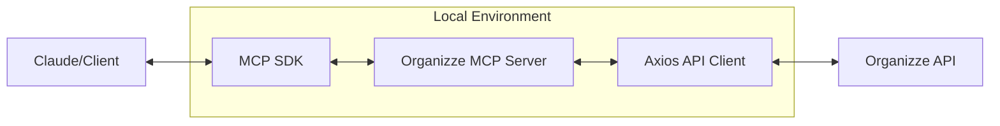

<p align="center">
  
</p>

# 💰 Organizze MCP Server

Refined and feature-complete Model Context Protocol (MCP) server for the [Organizze API](https://github.com/organizze/api-doc), designed for the best financial management experience.

[]()
[]()
[](./LICENSE)

## 🚀 Features

This server provides a high-level interface to the Organizze API, allowing you to manage your finances through Claude or any other MCP-compatible client.

- **🏦 Accounts**: Full management of bank accounts (Checking, Savings, and others).
- **📂 Categories**: Organize your transactions with a complete category management system.
- **💳 Credit Cards**: Manage your cards, monitor limits, view invoices, and track payments.
- **💸 Transactions**: Detailed transaction tracking with support for tags, recurrence, and installments.
- **🔄 Transfers**: Seamlessly record and manage transfers between your accounts.
- **🎯 Budgets (Metas)**: Monitor your financial goals and spending limits.
- **👤 User Profile**: Access your profile and account details.

## 🧠 How it works



## 📥 Installation

You can use the server without local installation via `npx` or `bunx`, or install it globally:

```bash
# Via NPM
npm install -g organizze-mcp

# Via Bun
bun install -g organizze-mcp
```

## 🛠 Setup

### 1. Credentials

You need an Organizze API Token to use this server.

- **Email**: Your account email.
- **Token**: Found at [Organizze API Keys](https://app.organizze.com.br/configuracoes/api-keys).
- **App Name**: Any string to identify your requests (e.g., "Your Name").

### 2. Claude Desktop Configuration

Add the following to your `claude_desktop_config.json`:

#### Option A: Using `npx` (No installation required)

```json
{
  "mcpServers": {
    "organizze": {
      "command": "npx",
      "args": ["-y", "organizze-mcp"],
      "env": {
        "ORGANIZZE_EMAIL": "your-email@example.com",
        "ORGANIZZE_TOKEN": "your-api-token",
        "ORGANIZZE_NAME": "Your Name"
      }
    }
  }
}
```

#### Option B: Using local installation

If you cloned the repository or installed it manually:

```json
{
  "mcpServers": {
    "organizze": {
      "command": "node",
      "args": ["/path/to/organizze-mcp/dist/index.js"],
      "env": {
        "ORGANIZZE_EMAIL": "your-email@example.com",
        "ORGANIZZE_TOKEN": "your-api-token",
        "ORGANIZZE_NAME": "Your Name"
      }
    }
  }
}
```

## 🧰 Tools Reference

### Users

- `get_user`: Get current user details.

### Accounts

- `list_accounts`: List all bank accounts.
- `get_account`: Get details of a specific account.
- `create_account`: Create a new bank account.
- `update_account`: Update account details (name, description, default status).
- `delete_account`: Permanently delete a bank account.

### Categories

- `list_categories`: List all categories.
- `get_category`: Get details of a specific category.
- `create_category`: Create a new category.
- `update_category`: Update category name or parent.
- `delete_category`: Delete a category (with optional replacement ID).

### Credit Cards & Invoices

- `list_credit_cards`: List all cards.
- `get_credit_card`: Get specific card details & limits.
- `create_credit_card`: Create a new credit card.
- `update_credit_card`: Update card details or limits.
- `delete_credit_card`: Delete a credit card.
- `list_invoices`: List all invoices for a card.
- `get_invoice`: Get detailed invoice info with transactions and payments.
- `pay_invoice`: Record a payment for an invoice.

### Transactions (Movimentações)

- `list_transactions`: List with filters (date, account, category, card).
- `get_transaction`: Get detailed transaction info.
- `create_transaction`: Create a new entry (supports tags, recurrence, and installments).
- `update_transaction`: Update entries (can apply to future occurrences).
- `delete_transaction`: Remove entries (can apply to future occurrences).
- `create_bulk_transactions`: Import multiple transactions at once.
- `delete_bulk_transactions`: Clean up multiple transactions.

### Transfers

- `list_transfers`: List transfers between accounts.
- `get_transfer`: Get details of a transfer.
- `create_transfer`: Record a new transfer.
- `update_transfer`: Update transfer details.
- `delete_transfer`: Remove a transfer.

### Budgets

- `list_budgets`: Monitor your budgets (metas) for any given period.

## 🚄 Bulk Operations

The multi-resource tools (`create_bulk_transactions`, `delete_bulk_transactions`) are designed for reliability:

- **Structured Summary**: Returns a clear count of successes vs. failures.
- **Fail Fast Mode**: Use `fail_fast: true` to stop immediately if an error occurs. This is recommended for large imports where consistency is key.
- **Detailed Error Reporting**: Identifies exactly which transaction failed and why, including the original data index.

## 💻 Development

1. Clone the repo
2. Install dependencies: `bun install`
3. Run in dev mode: `bun run dev`
4. Build: `bun run build`

## 🗺️ Roadmap

- [ ] Support for Bank Statement (OFX/CSV) parsing.
- [ ] Direct integration with common bank exports (Nubank, Inter, etc).
- [ ] Advanced financial charts via MCP Resources.
- [ ] Multi-account consolidation reports.

## 🤝 Community & Support

- **Bugs & Features**: Please open an [issue](https://github.com/weslleyr/organizze-mcp/issues).
- **Contributions**: Pull requests are welcome! See [`CONTRIBUTING.md`](./CONTRIBUTING.md).
- **Questions**: Reach out to the maintainers or start a Discussion.

---

Built with ❤️ by [WeslleyR](https://github.com/weslleyr) for better financial control.
